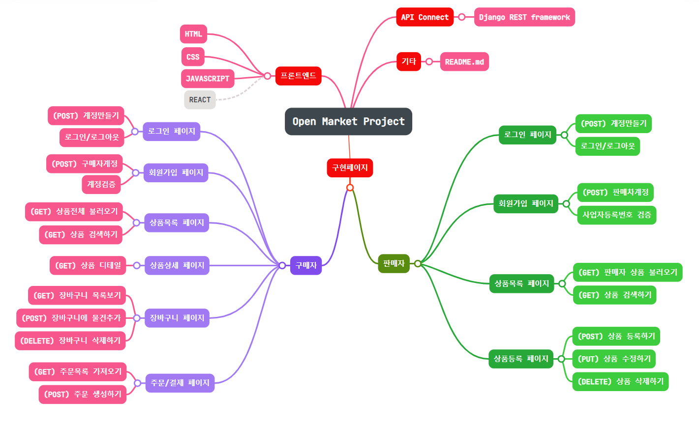
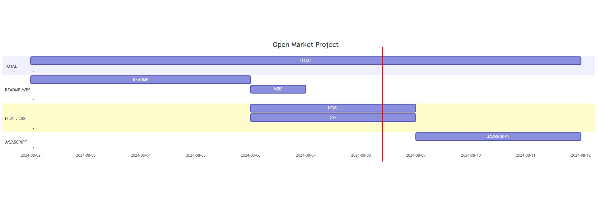

# 오픈마켓 서비스 제작
## 1. 주요 목적과 기능
### 1.1 목적
- 사용자에게 원하는 상품들을 주문 및 결제를 할 수 있도록 하는 마켓 플랫폼.

### 1.2 기능
- 사용자가 가지고 있는 고유한 정보를 계정을 통해 생성.
- 로그인,로그아웃으로 계정인증후 사용자에게 장바구니 및 결제서비스 제공.
- 시각적으로 상품들을 볼 수있게 상품목록 제공.
- 구체적으로 상품 기능을 설명하는 상품상세정보 제공.
- 장바구니를 통해 원하는 상품들을 여러개 담을 수 있게 함.
- 단일 상품이나 장바구니에 담은 상품들을 바로 구매 할수 있는 결제창 제공.
## 2. 개발 환경 및 배포 URL
### 2.1 개발 환경
- Visual Studio Code (코드 작성 환경)
- github (서비스 배포 환경)

### 2.2 배포 URL
- (나중에 추가 예정)

### URL 구조(마이크로식)
|app:accounts|HTTP Method|설명|로그인 권한 필요|작성자 권한 필요|
|---|---|---|---|---|
|login/|POST|로그인|||
|signup/|POST|회원가입|||
|user/main/|GET|구매자메인|✅||
|seller/main/|GET|판매자메인|✅||
|user/detail/|GET|상품상세정보|||
|seller/center/|GET|판매자센터|✅||
|seller/register/|POST|판매자상품등록|✅||
|cart/|GET|장바구니|✅||
|payment/|POST|주문및결제|✅|✅|
|status/|GET|페이지상태||✅|

## 3. 요구사항 명세와 기능명세

## 4. 개발일정 (WBS)
